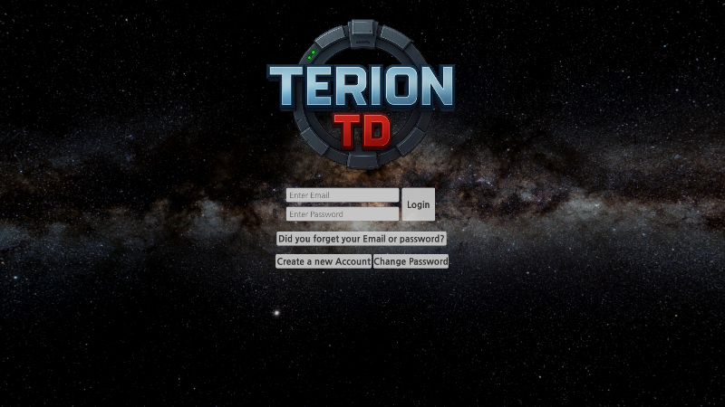
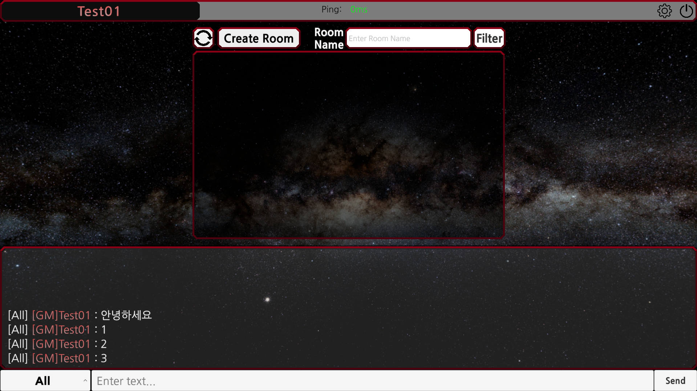
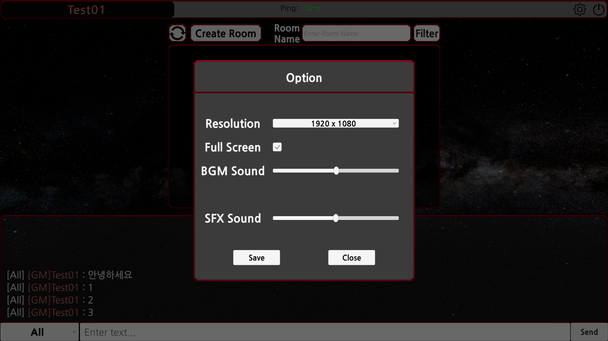
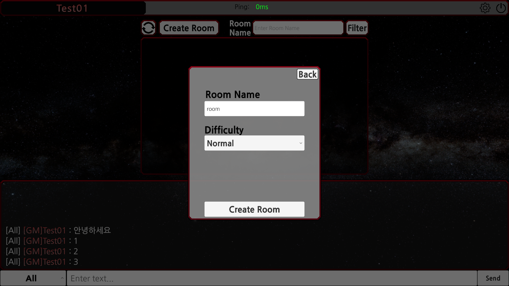
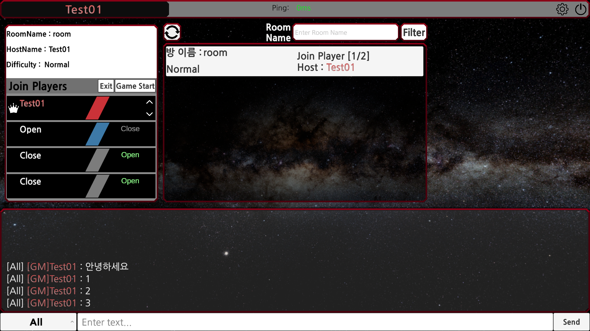
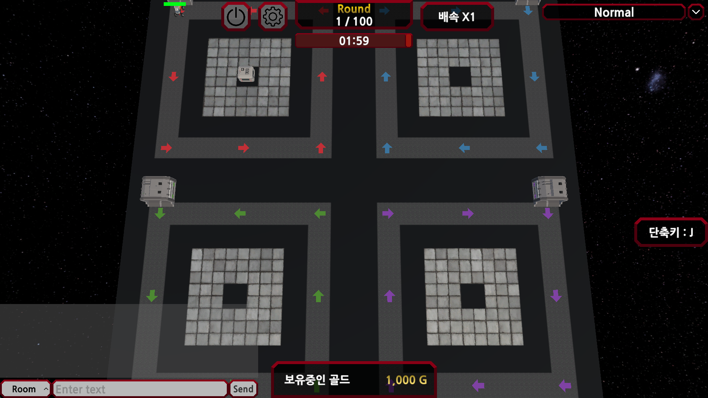
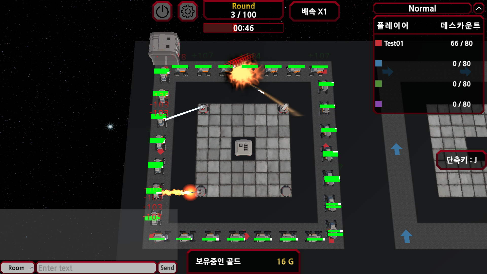
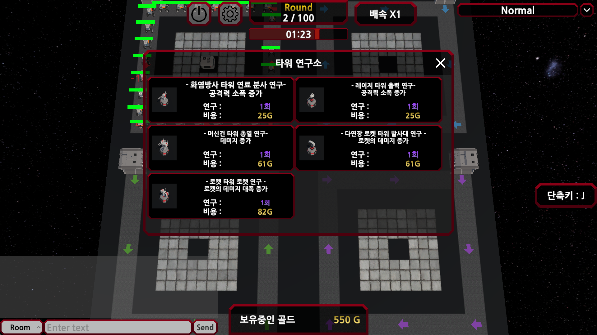

# TerionTD

우주 정거장 Terion을 배경으로 한 최대 4인 멀티플레이 타워 디펜스 게임입니다. 타워를 건설하고 업그레이드하며 자신의 라인에 쌓이는 적을 저지합니다. 플레이어마다 라운드와 승패가 독립적으로 진행됩니다.

## 프로젝트 소개

| 항목 | 내용 |
|---|---|
| 장르 / 인원 | 타워 디펜스 / 최대 4인 |
| 플랫폼 | Windows PC |
| 클라이언트 | Unity 6, C#, URP, uGUI, TextMeshPro, DOTween |
| 서버 | .NET 8, MySQL 8.0, Ubuntu VPS |
| 통신 | TCP / UDP 기반 JSON 소켓 프로토콜 |

### 주요 기능

- 회원가입, 로그인, 방 생성·입장, 자리 이동, 방장 위임, 채팅
- 머신건·로켓·레이저·화염방사 타워 건설 및 업그레이드
- 플레이어별 라운드·타이머·생존 적 수 관리와 개별 승패 처리
- 호스트 교체, 적 이동 보간, 투사체 오브젝트 풀링
- 타워 본체 선택과 공격 범위 표시 분리

인증·로비·채팅은 TCP로 처리하고, 게임 중 전투 이벤트와 상태 동기화는 UDP를 사용합니다. 호스트 클라이언트가 적 체력과 라운드·승패를 판정하며, 피어 간 직접 연결이 준비되지 않은 경우 서버 중계로 전송합니다.

서버 코드: [TDGameServer](https://github.com/woong020477/TDGameServer)

## 스크립트 구조

[Scripts](Scripts) 아래에 게임플레이, 네트워크, UI, 데이터 등 기능별로 스크립트를 구분했습니다.

| 경로 | 역할 | 주요 스크립트 |
|---|---|---|
| [Gameplay/Match](Scripts/Gameplay/Match) | 게임 초기화, 호스트 교체, 플레이어별 라운드와 결과 | [GameManager](Scripts/Gameplay/Match/GameManager.cs), [WaveManager](Scripts/Gameplay/Match/WaveManager.cs) |
| [Gameplay/Player](Scripts/Gameplay/Player) | 플레이어 입력, 골드, 건설 모드 | [PlayerController](Scripts/Gameplay/Player/PlayerController.cs) |
| [Gameplay/Enemies](Scripts/Gameplay/Enemies) | 적 이동·체력·상태 동기화와 스폰 | [Enemy](Scripts/Gameplay/Enemies/Enemy.cs), [EnemySpawner](Scripts/Gameplay/Enemies/EnemySpawner.cs) |
| [Gameplay/Towers](Scripts/Gameplay/Towers) | 표적 탐색, 공격 주기, 공격 범위 표시 | [TowerController](Scripts/Gameplay/Towers/TowerController.cs), [TowerRangeIndicator](Scripts/Gameplay/Towers/TowerRangeIndicator.cs) |
| [Gameplay/Projectiles](Scripts/Gameplay/Projectiles) | 투사체 추적·명중·풀 반환과 무기별 연출 | [BurstProjectile](Scripts/Gameplay/Projectiles/BurstProjectile.cs), [Bullet](Scripts/Gameplay/Projectiles/Bullet.cs), [Rocket](Scripts/Gameplay/Projectiles/Rocket.cs) |
| [Gameplay/Building](Scripts/Gameplay/Building) | 타워 건설·이동과 플레이어 영역 검사 | [BuildingSystem](Scripts/Gameplay/Building/BuildingSystem.cs) |
| [Networking/Session](Scripts/Networking/Session) | 접속 설정, 인증 세션, 서버 응답 이벤트 | [AuthManager](Scripts/Networking/Session/AuthManager.cs), [ServerEndpointConfig](Scripts/Networking/Session/ServerEndpointConfig.cs) |
| [Networking/Transport](Scripts/Networking/Transport) | TCP 메시지 분리, UDP 송수신과 메인 스레드 전달 | [TcpLineConnection](Scripts/Networking/Transport/TcpLineConnection.cs), [JsonLineBuffer](Scripts/Networking/Transport/JsonLineBuffer.cs), [UDPClient](Scripts/Networking/Transport/UDPClient.cs) |
| [Networking/Messages](Scripts/Networking/Messages) · [Identity](Scripts/Networking/Identity) | 통신 메시지 정의와 소유자별 엔티티 식별 | [RoomMessages](Scripts/Networking/Messages/RoomMessages.cs), [NetworkEntityKey](Scripts/Networking/Identity/NetworkEntityKey.cs) |
| [UI](Scripts/UI) | 로그인·로비·채팅·게임 HUD·설정 화면 | [LobbyManager](Scripts/UI/Lobby/LobbyManager.cs), [UIManager](Scripts/UI/Hud/UIManager.cs) |
| [Data](Scripts/Data) | 타워 업그레이드 수치와 웨이브 데이터 | [TowerUpgradeCatalog](Scripts/Data/Towers/TowerUpgradeCatalog.cs), [Wave](Scripts/Data/Waves/Wave.cs) |
| [Input](Scripts/Input) | 입력 이벤트와 타워 선택 판정 | [InputManager](Scripts/Input/InputManager.cs), [SelectManager](Scripts/Input/Selection/SelectManager.cs) |
| [Presentation](Scripts/Presentation) | 카메라와 오디오 제어 | [CameraManager](Scripts/Presentation/Camera/CameraManager.cs), [SoundManager](Scripts/Presentation/Audio/SoundManager.cs) |
| [Infrastructure/Pooling](Scripts/Infrastructure/Pooling) | 오브젝트 풀 생성·대여·반환 | [ObjectPoolManager](Scripts/Infrastructure/Pooling/ObjectPoolManager.cs) |

## 이슈 트래킹

### 1. TCP 응답 분할·병합에 따른 JSON 파싱 오류

한 번의 소켓 수신을 하나의 메시지로 처리하면 응답이 나뉘거나 여러 개가 붙어 도착할 때 파싱이 실패했습니다. 수신 데이터를 버퍼에 누적하고 줄바꿈으로 완성된 메시지만 분리하도록 전송 계층을 구성했습니다.

### 2. 방 상태 변경 후 UI 갱신 누락

자리 이동·방장 위임·강퇴 이후에도 방 패널에 이전 정보가 남았습니다. 서버 응답 이벤트를 기준으로 목록과 상세 화면을 갱신하고, 강퇴·방 삭제 시 관련 패널과 세션 정보를 함께 정리했습니다. 갱신 알림은 수동 요청에만 표시하도록 분리했습니다.

### 3. 다른 플레이어의 타워 선택·조작 UI 간섭

원격 업그레이드가 로컬 선택 창에 반영되거나 타인의 영역에 건설·이동할 수 있었습니다. 소유자와 로컬 ID를 결합해 타워를 식별하고, 원격 상태 갱신과 로컬 선택을 분리했습니다. 조작 버튼과 실제 건설·이동 처리에도 소유권·영역 검사를 적용했습니다.

### 4. 라운드 공유와 호스트 교체 후 타이머 정지

플레이어별 진행 상태와 호스트 판정 권한이 섞여 라운드가 공유되고, 호스트 교체 후 타이머가 재개되지 않았습니다. 각 라인의 진행·휴식·종료 상태를 독립적으로 관리하고, 새 호스트가 기존 웨이브와 스폰 상태를 이어받도록 변경했습니다.

### 5. 연사 중 파괴된 적 참조와 반복 패킷

늦게 도착한 발사 이벤트가 사망한 적을 참조해 예외가 발생했고, 매 발마다 반복되는 통신으로 비호스트 화면이 끊겼습니다. 발사 재현 전 대상의 생존 여부를 확인하고, 연사 표적을 고정해 합산 피해를 한 번만 판정하도록 변경했습니다. 나머지 탄환은 연출로 처리하며 대상 사망 시 즉시 풀로 반환합니다.

## 플레이 이미지

추가 화면 보기

